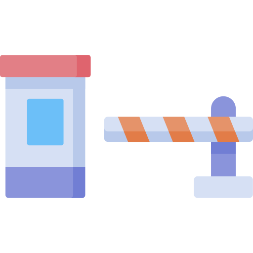
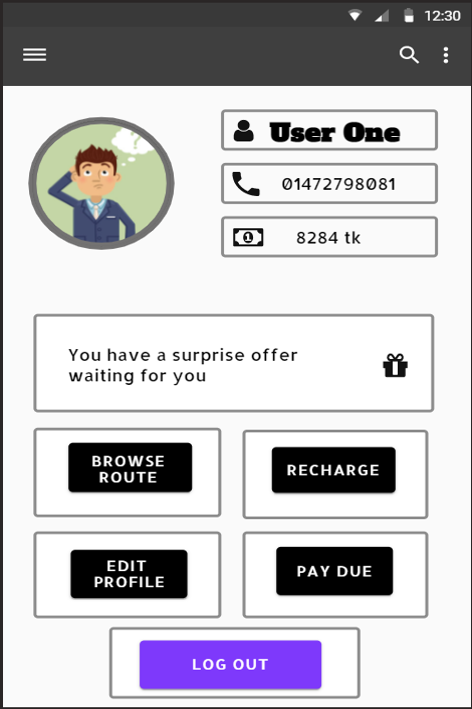
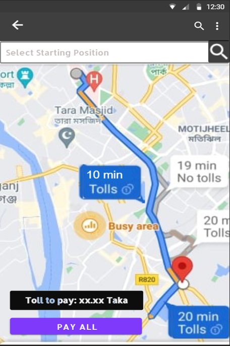
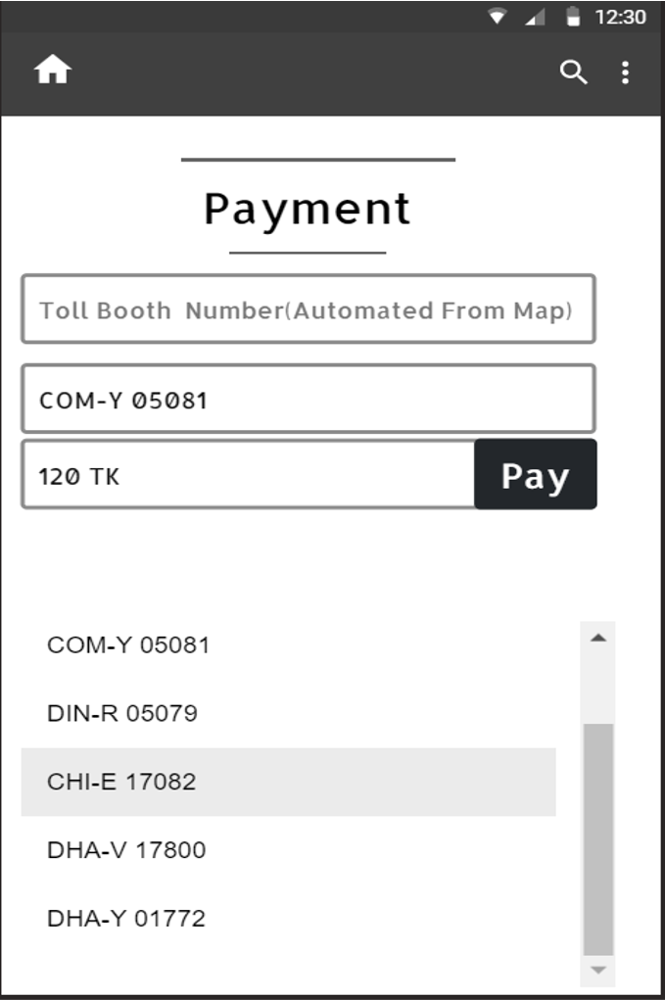
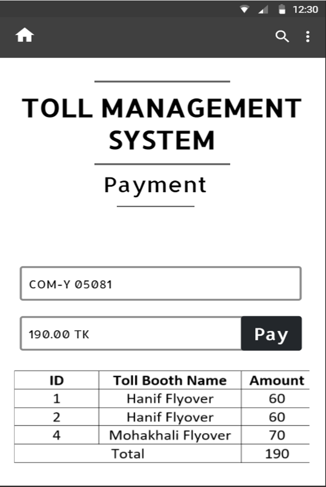
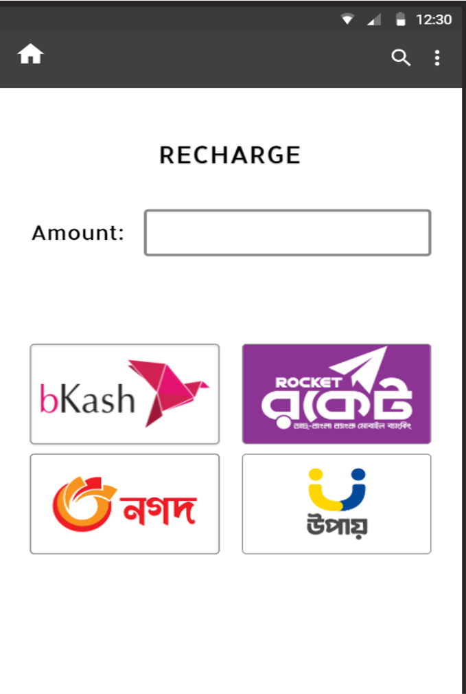
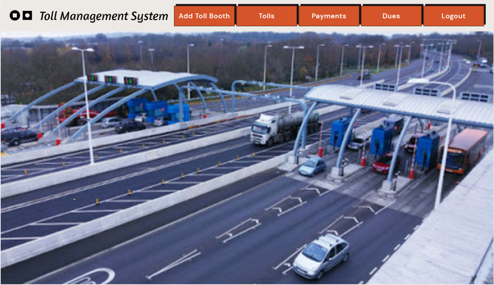
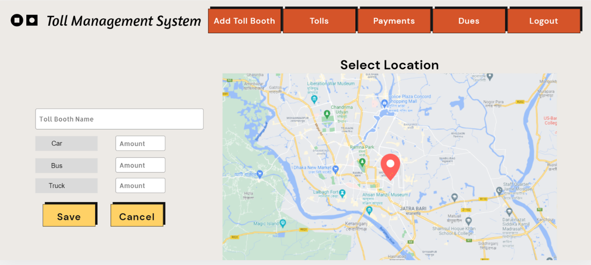
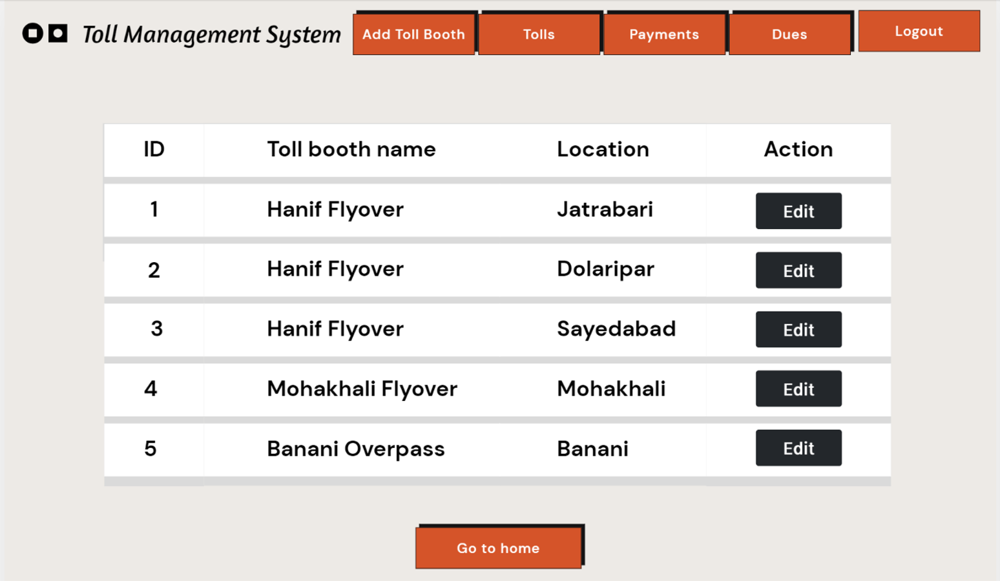
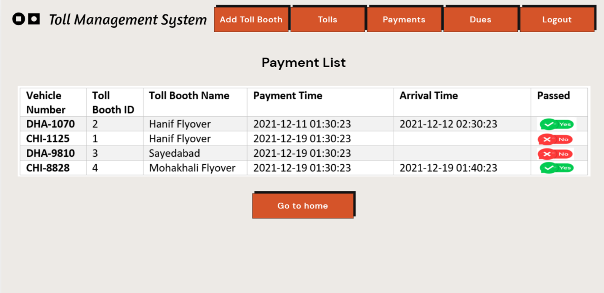

<a name="readme-top"></a>

<!-- PROJECT SHIELDS -->
[![Contributors][contributors-shield]][contributors-url]
[![Stargazers][stars-shield]][stars-url]
<!-- [![Youtube Link][youtube-shield]](https://youtu.be/LVSId1obOoE) -->


<!-- PROJECT LOGO -->
<br />
<div align="center">
  <a href="https://github.com/mrmajumder/toll-management-system">
    
  </a>

<h3 align="center">Toll Management System</h3>
  <p align="center">
    A Full-stack All-encompassing Toll Management and Payment System
    <br />
    <br />
  </p>
</div>


<!-- TABLE OF CONTENTS -->
<details>
  <summary>Table of Contents</summary>
  <ol>
    <li>
      <a href="#about-the-project">About The Project</a>
      <ul>
        <li><a href="#built-with">Built With</a></li>
        <li><a href="#project-images">Project Images</a></li>
      </ul>
    </li>
    <li>
      <a href="#getting-started">Getting Started</a>
      <ul>
        <li><a href="#prerequisites">Prerequisites</a></li>
        <li><a href="#installation">Installation</a></li>
      </ul>
    </li>
    <li><a href="#contributors">Contributors</a></li>
    <!-- <li><a href="#acknowledgments">Acknowledgments</a></li> -->
  </ol>
</details>


<!-- ABOUT THE PROJECT -->
## About The Project

**Motivation:** Toll collection is a common phenomena in all countries. Many a times, collecting tolls is a manual process, where cars have to halt to a stand still to pay their tolls and collect the receipts. In highways and city roads, this process may be responsible for traffic jam and delay of passengers. 

Therefore, in this term project for the course *"CSE326: Information System Design Sessional"*, we propose a novel way of automating the toll collection process via automated collectors. These auto-booths will click photos of a car's license plate, extract the car's number, and automatically bill that customer for the toll amount. Therefore, cars won't need to stop or even slow down, decreasing traffic jams. 

Of course, this comes it it's own problems such as security concerns, fake number plate detection etc. In this project, we are not concerned with scanning the number plates, but only the information system needed to manage the entire process.

In this project, we have designed a mobile app for the users, and webapp for the admin for management purposes. Therefore, the project's capabilities are: 

### Customers
* Allow customers to signup, login, manage profile
* Browse and select the route, which the user may use to his advantage by picking a route that decreases the total toll amount.
* Make payment for pending or future tolls.
* Maintain a wallet, that is rechargeable.

### Admin
* Allow the admins to signup, login, and manage their profile
* Add, remove, modify toll booths in the system
* Check and track payment history, monitor dues of customers
* Monitor illegal and suspicious activities through logs

This project was created by following software design best practices, and went through an extensive designing phase. During the design phase, we created the following diagrams: [BPMN](diagrams/bpmn.png), [class diagram](diagrams/class.png) and [ER diagram](diagrams/er.png). 

Moreover, the SQL queries and database table creations can be found in the [database](database/) folder.

All presentations for the project (BPMN, ER diagram, Mock UI) can be found in the [presentations](presentations/) folder.

This project received **full marks** in the final assessment. 

<p align="right">(<a href="#readme-top">back to top</a>)</p>


### Built With

[](https://www.djangoproject.com/)
[![React][React.js]][React-url]
[](https://www.oracle.com/database/)
[](https://www.python.org/)
[](https://www.sqlite.org/index.html)

<p align="right">(<a href="#readme-top">back to top</a>)</p>


### Project Images

User part:
<p float="left" align="middle">
  
   
   
  
   
</p>

Admin part:
<p float="left" align="middle">
  
  
   
   
</p>

<p align="right">(<a href="#readme-top">back to top</a>)</p>


<!-- GETTING STARTED -->
## Getting Started

This is an example of how you may set up this project locally.
To get a local copy up and running follow these simple example steps.

### Prerequisites

This is an example of things you need to use the software.
  ```sh
  python, django, react.js, oracle-db, sqlite
  ```


### Installation
First clone the repo
```sh
git clone https://github.com/mrmajumder/toll-management-system.git
```


For running the **front end** of the project: 
1. At first go to frontend directory.
    ```sh
    cd frontend
    ```
2. Import all node modules.
    ```sh
    npm install
    ```
3. After successfully importing node-modules run `npm start` to run the frontend.
4. Wait for a while, A window will open in browser. And thats it.

For running the **back end** of the project: 
1. At first go to backend directory.
    ```sh
    cd backend
    ```
2. Install prerequisites by running the following commands
    ```sh
    pip install djangorestframework
    pip install django-cors-headers
    ```
3. Now run the backend server with the following command
    ```sh
    python manage.py runserver
    ```
4. After a while, the server will run locally in `http://127.0.0.1:8000/`. 


<p align="right">(<a href="#readme-top">back to top</a>)</p>


<!-- CONTRIBUTING -->
## Contributors

* Shafayat Hossain Majumder - [GitHub][github-url] | [LinkedIn][linkedin-url] | [Mail][email] | [Website][website-url]
* Sourov Jajodia - [GitHub](https://github.com/Sourov72) | [LinkedIn](https://www.linkedin.com/in/sourov72) | [Mail](mailto:sourov.jajodia72@gmail.com) | [Website](https://sourov72.github.io)
* Md. Kamrujjaman - [GitHub](https://github.com/kamrul-s) | [LinkedIn](https://www.linkedin.com/in/md-kamrujjaman-085a74194/)
* Kazi Wasif Amin Shammo - [GitHub](https://github.com/shammya) | [LinkedIn](https://www.linkedin.com/in/kazi-wasif-amin-shammo-3a0307197/)
* Asif Ahmed Utsa - [GitHub](https://github.com/asifahmedutsa)
* Md. Mehedi Hasan - [GitHub](https://github.com/md-mehedi)

<p align="right">(<a href="#readme-top">back to top</a>)</p>


<!-- MARKDOWN LINKS & IMAGES -->
<!-- https://www.markdownguide.org/basic-syntax/#reference-style-links -->
[contributors-shield]: https://img.shields.io/github/contributors/mrmajumder/toll-management-system.svg?style=for-the-badge
[contributors-url]: https://github.com/mrmajumder/toll-management-system/graphs/contributors
[forks-shield]: https://img.shields.io/github/forks/mrmajumder/toll-management-system.svg?style=for-the-badge
[forks-url]: https://github.com/mrmajumder/toll-management-system/network/members
[stars-shield]: https://img.shields.io/github/stars/mrmajumder/toll-management-system.svg?style=for-the-badge
[stars-url]: https://github.com/mrmajumder/toll-management-system/stargazers
[issues-shield]: https://img.shields.io/github/issues/mrmajumder/toll-management-system.svg?style=for-the-badge
[issues-url]: https://github.com/mrmajumder/toll-management-system/issues
[license-shield]: https://img.shields.io/github/license/mrmajumder/toll-management-system.svg?style=for-the-badge
[license-url]: https://github.com/mrmajumder/toll-management-system/blob/master/LICENSE.txt
[linkedin-shield]: https://img.shields.io/badge/-LinkedIn-black.svg?style=for-the-badge&logo=linkedin&colorB=555
[linkedin-url]: https://linkedin.com/in/monsieurmajumder
[youtube-shield]: https://img.shields.io/badge/Video%20Demo-FF0000?style=for-the-badge&logo=youtube&logoColor=white
[github-url]: https://github.com/MrMajumder/
[email]: mailto:monsieurmajumder@gmail.com
[website-url]: https://mrmajumder.github.io/

[React.js]: https://img.shields.io/badge/React-20232A?style=for-the-badge&logo=react&logoColor=61DAFB
[React-url]: https://reactjs.org/
[Bootstrap.com]: https://img.shields.io/badge/Bootstrap-563D7C?style=for-the-badge&logo=bootstrap&logoColor=white
[Bootstrap-url]: https://getbootstrap.com

